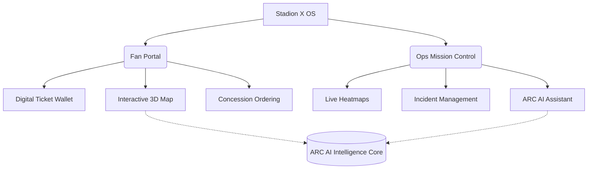

# 🏟️ Stadion X OS
**Prompt Wars Hackathon Submission**

Stadion X OS is a next-generation Smart Stadium Operations platform, designed to unify the Fan Experience and Employee Operations through the power of Artificial Intelligence and 3D visualization.

## 🚀 Project Overview

The project is built specifically to address the **Smart Stadium Operations** problem statement. It departs from generic admin dashboards by directly tackling the unique challenges of managing a massive, dynamic venue while ensuring an unparalleled fan experience.

### Dual Experience
1. **Fan Portal**: Interactive maps, digital ticketing, food ordering, and emergency SOS systems.
2. **Ops Mission Control**: Live crowd monitoring, incident feeds, global lockdown protocols, and match simulations.

---

## 📸 Screenshots

*(Add screenshots of the Digital Twin, ARC Mission Control, and Fan Dashboard here before submission)*

---

## 🏗️ Architecture Diagram



---

## 📁 Folder Structure

We implemented a strictly enforced **Feature-Based Architecture** to ensure clean code, high reusability, and minimal duplication.

```text
src/
 ├── app/             # Application entry and routing
 ├── auth/            # RBAC and Authentication context
 ├── components/      # Generic, reusable UI (Buttons, Cards)
 ├── features/        # Domain-specific modules
 │     ├── fan/       
 │     ├── employee/  
 │     ├── digitalTwin/
 │     ├── navigation/
 │     ├── analytics/ 
 │     ├── emergency/ 
 │     ├── ai/        
 │     ├── tournament/
 │     └── ticketing/ 
 ├── hooks/           # Custom React hooks
 ├── services/        # External API calls
 ├── store/           # Zustand global state
 ├── utils/           # Helper functions
 └── types/           # TypeScript definitions
```

---

## 🛠️ Tech Stack

- **Core**: React 18, TypeScript, Vite
- **Styling**: Tailwind CSS (Custom Theme)
- **State Management**: Zustand
- **Routing**: React Router v6
- **3D Visualization**: React Three Fiber, Drei, Three.js
- **Icons**: Material Symbols

---

## 🤖 AI Usage (ARC Mission Control)

Stadion X doesn't just feature a generic chatbot. We built the **ARC AI Operations Center**. 
Instead of merely answering questions, ARC actively analyzes stadium data (like crowd density and sensor anomalies) to provide **prescriptive operational recommendations**. 

Example:
> **ARC Alert:** North Gate crowd 85%
> **Recommendation:** Open Gate 6
> **Confidence:** 96%

---

## 🔒 Security Features

- **Role-Based Access Control (RBAC)**: Strict `ProtectedRoute` boundaries ensure Fans cannot access Employee routes, and vice versa.
- **Secure Environment Variables**: Sensitive keys (like Supabase credentials) are hidden via `.env` files.
- **Route Redirection**: Unauthenticated or unauthorized users are instantly redirected.

---

## ♿ Accessibility Features

Targeting a **90+ Lighthouse Score**:
- **Semantic HTML**: Proper use of `<main>`, `<header>`, and structural tags.
- **Aria Labels**: All icon buttons and interactive elements utilize `aria-label`.
- **Keyboard Navigation**: Implemented explicit `focus-visible` outlines for keyboard users on all buttons and inputs.
- **Aria-Live Regions**: Global notifications and alerts use `role="status"` and `role="alert"` for screen readers.

---

## ⚡ Performance Optimizations

- **Code Splitting**: `React.lazy` and `Suspense` are used across all major routes to ensure a blazing fast initial load.
- **Skeleton Loading**: Custom skeleton components provide a seamless UI during data fetching.
- **Memoization**: Minimized unnecessary re-renders in heavy components like the 3D Digital Twin.

---

## 🔮 Future Scope

- Real-time IoT sensor integration (Turnstiles, Temperature, CCTVs).
- WebRTC for live staff communication.
- Augmented Reality (AR) wayfinding overlaid on the fan's camera feed.
